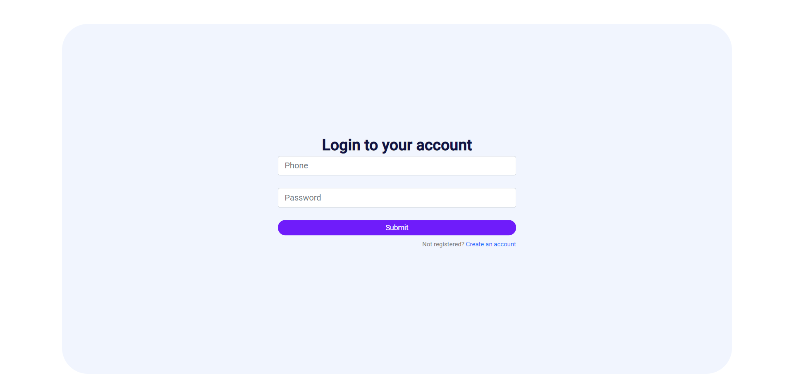
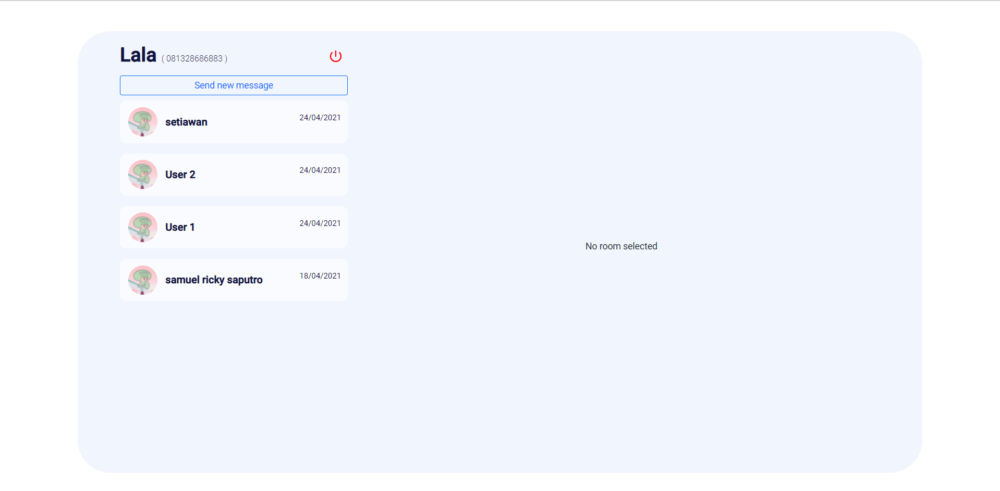
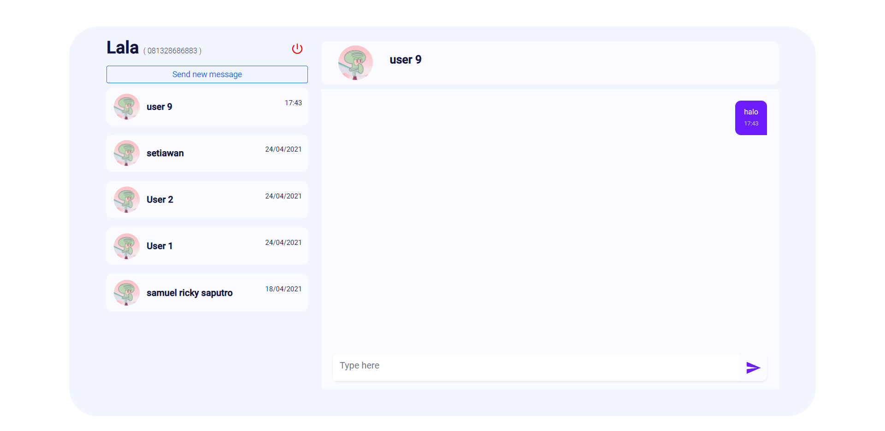

# JusText App

This project was generated with [Angular CLI](https://github.com/angular/angular-cli) version 11.2.5.

This repo shows an example chat application using Angular 2. The goal is to implement Real Time Messaging with Angular 2. It also features:

* Express configuration with TypeScript, and tslint
* Use of injectables, forms, routing & navigation services in Angular 2
* And much more


## Screenshots
<p align="center">
  
</p>
<p align="center">
  
</p>
<p align="center">
  
</p>
  

## Quick start

```bash
# clone the repo
git clone https://github.com/f-chilmi/just-text-app.git

# change into the repo directory
cd just-text-app

# install 
npm install

# run
npm start
```

Then visit [http://localhost:4200](http://localhost:4200) in your browser. 